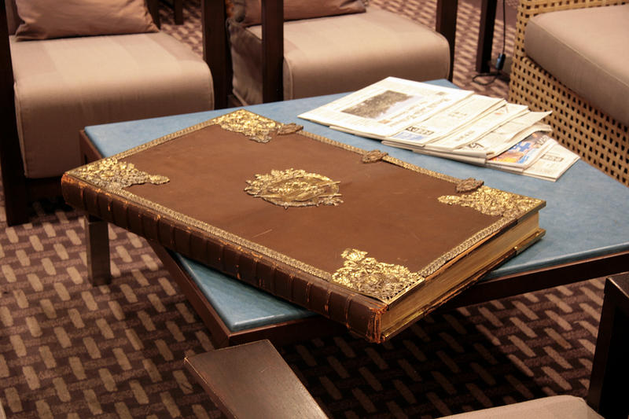
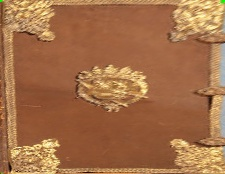

# Image_Warping
Warping an image to a bird view.

Using Pithagora's theorem to get hight and width of the object. That would, of course, not be the right height and width, but lacking ways how to find the right dimensions.

Added lines to follow selecting the dots, to you know what kind of the rectangle (or other shape) you are making.

# Example

### Original Image

### Warped Image

